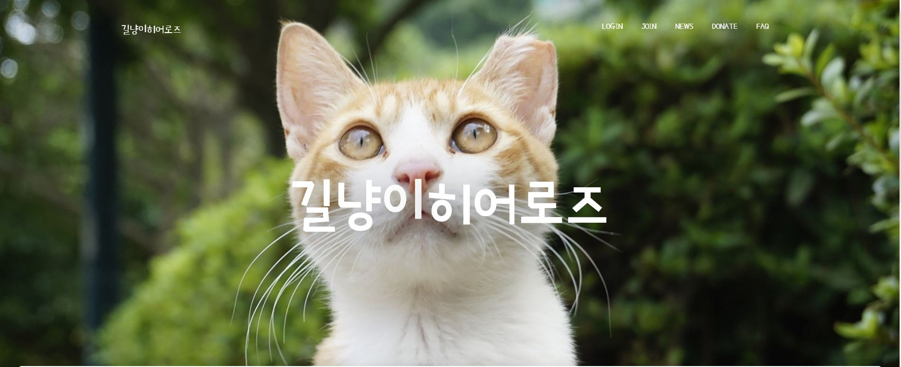

<!-- PROJECT LOGO -->
<br />
<p align="center">
  <a href="README.md">
    
  </a>

  <h2 align="center">길냥이 히어로즈</h2>

  <p align="center">
    길고양이와 돌봄이들의 공존을 위한 서비스
    <br />
</p>

<br>

<!-- ABOUT THE PROJECT -->

## :paperclip: 프로젝트 소개

> 주변 길고양이를 사진으로 검색해서 찾아 정보 공유를 하자!!!

&nbsp; 길냥이 히어로즈는 길고양이와 돌보는 사람들의 공존을 지향하는 커뮤니티 웹사이트입니다.
<br>
<br>
&nbsp;우리동네 주변의 길고양이들은 많은 사람들의 귀여움을 받고 있지만, 일부 시민들에게 피해를 주고있는 것 또한 사실입니다.
길냥이히어로즈는 길고양이들이 적절한 관리를 받음으로써 이러한 문제를 완화시킬 수 있다고 믿습니다.
<br><br>
&nbsp;길냥이 히어로즈는 이미지 패턴분석 기능을 제공합니다.
사용자가 길고양이 사진을 업로드하면 품종을 분석하여 기등록된 길고양이 중 같은 품종의 길고양이 리스트를 보여줍니다.
해당 길고양이가 아직 등록되지 않았다면, 새로운 길고양이를 지도에 추가할 수 있습니다.
게시글 작성, 팔로우기능 및 알람기능을 사용하여 애묘인들과 실시간으로 커뮤니케이션이 가능합니다.
아임포트로 도움이 필요한 길고양이에 대해 모금기능을 활성화하여 실제 계좌이체가 가능하도록 구현하였습니다.
이메일인증, 비밀번호 암호화, SSL 방식의 보안서버 구축을 통해 회원계정의 보안을 강화하였습니다.

<br>

<br>

### :clipboard: 프로젝트 산출물

- [프로젝트 계획서](./document/공통PJT_구미2반_D206_계획서.docx)
- [길냥이 히어로즈 발표자료](./document/공통PJT_구미2반_D206_PPT.pptx)

### :clipboard: 데모영상

[](https://youtu.be/z1T9MDCg0s0?t=0s)

### :clipboard: 기능 소개

<h3>알림기능 　　　　　　　　　　　　　　　　　뉴스크롤링</h3>
<br>

<br>

<h3>이메일 인증　　　　　　　　　　　　　　인피니티스크롤</h3>
<br>


<br>

<h3>후원기능　　　　　　　　　　　　　　SSL</h3>
<br>


<br>

### Built With

사용한 프레임워크

- [Vue.js](https://vuejs.org/)
- [Spring Boot](https://spring.io/projects/spring-boot)
- [Django](https://www.djangoproject.com/)

<br>

<!-- GETTING STARTED -->

## :gear: Getting Started

길냥이 히어로즈 시작 방법입니다.

### Installation

1. Clone the repo

```sh
git clone https://lab.ssafy.com/s03-webmobile1-sub3/s03p13d206
```

2. 프론트 실행

```sh
cd frontend
npm i
yarn serve --port 3000
```

3. 케라스(파이썬 버전 최신버전 사용권장)

```sh
cd keras
python -m venv venv
source venv/Scripts/activate
pip install -r requirements.txt
python manage.py migrate
python manage.py runserver
```

4. 백엔드 실행

```sh
cd backend
mvn spring-boot:run
```

<br>

## :hammer_and_pick: 개발스택

협업Tool

- [GitLab](https://about.gitlab.com/)
- [Jira](https://www.atlassian.com/software/jira/)
- [Mattermost](https://mattermost.com/)
- [Postman](https://www.postman.com/)
- [Notion](https://www.notion.so/)

Languege

- JavaScript
- [Java](https://java.com/ko/download/)
- [python](https://www.python.org/)

DB

- [MariaDB](https://mariadb.org/)

Library

- [JWT](https://jwt.io/)
- [javaMail](https://javaee.github.io/javamail/)
- [Spring boot](https://spring.io/projects/spring-boot/)
- [Spring security](https://spring.io/projects/spring-security/)
- [Spring Data JPA](https://spring.io/projects/spring-data-jpa)
- [keras](https://keras.io/)
- [Yolo](https://pjreddie.com/yolo/)

API

- [Kakao](https://developers.kakao.com/)
- [I'mport](https://www.iamport.kr/)
- [AWS SDK](https://aws.amazon.com/ko/sdk-for-java/)

ETC

- RestfulApi
- [Swagger](https://swagger.io/)
- SSL

<br>

<!-- CONTACT -->

## :busts_in_silhouette: Contact

### [Samsung Software Academy for Youth](https://www.ssafy.com/) 1th Gumi, 공통프로젝트 D206

- `김영민` - kastori1990@gmail.com<br>
- `김현국` - khg6152450@naver.com<br>
- `이원희` - haruu0419@gmail.com<br>
- `최수병` - chb0328@gmail.com <br>

Project Link: [https://lab.ssafy.com/s03-webmobile1-sub3/s03p13d206](https://lab.ssafy.com/s03-webmobile1-sub3/s03p13d206)

<br>

<!-- ACKNOWLEDGEMENTS -->

## 참고문서

- [케라스 이미지 학습](https://github.com/lsjsj92/keras_basic/blob/master/7.%20predict_multi_img_with_CNN.ipynb)
- [객체 분석](https://bong-sik.tistory.com/16)
- [스프링 부트 배포](https://steady-hello.tistory.com/49?category=821268)
- [스프링 부트 SSL](https://knasmueller.net/lets-encrypt-ssl-certificates-for-dockerized-spring-boot-in-2020)
- [텐서플로우 GPU에러](https://lv99.tistory.com/51)
- [우분투 MariaDB설치](https://yunyoung1819.tistory.com/95)
- [MariaDB 외부접속](https://kithub.tistory.com/entry/mariaDB-%EB%A7%88%EB%A6%AC%EC%95%84-DB-%EC%99%B8%EB%B6%80%EC%A0%91%EC%86%8D%EC%9D%B4-%EC%95%88%EB%90%A0%EB%95%8C)
- [STS LomBok 적용](https://yunyoung1819.tistory.com/95)
- [VSCODE jdk11에러 해결](https://www.notion.so/VSCODE-jdk11-83fbee3432d34c6ca253c32b94e2cc85)
  <br>
